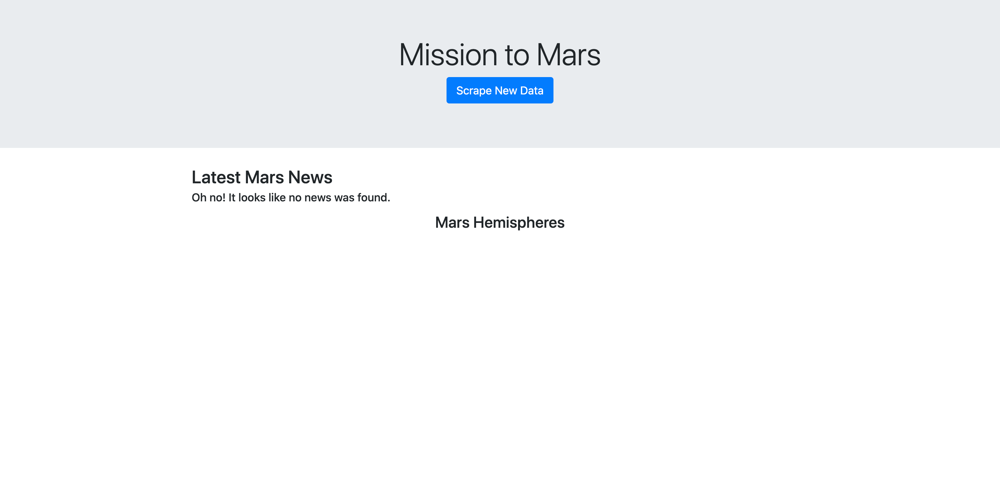

# web-scraping-challenge

This project is powered by:
- [BeautifulSoup](https://www.crummy.com/software/BeautifulSoup/bs4/doc/)
- [Flask](https://flask.palletsprojects.com/en/1.1.x/)
- [Jinja2](https://jinja.palletsprojects.com/en/2.11.x/)
- [numpy](https://numpy.org/)
- [pandas](https://pandas.pydata.org/)
- [MongoDB](https://www.mongodb.com/)
- [Selenium](https://www.selenium.dev/)
- [Splinter](https://splinter.readthedocs.io/en/latest/drivers/chrome.html)

For a complete list of dependencies, visit [requirements.txt](./requirements.txt)
This web application leveraged the following chrome version:
> Version 84.0.4147.135 (Official Build) (64-bit)

on a Mac running

>  OSX Catalina 10.15.5 (19F101)

With chromedriver installed at:

> `/usr/local/bin/chromedriver`

The web application is designed to run a headless chrome window to then scrape data from various URLs. This data is then saved into MongoDB, and displayed via a Bootstrap and Jinja template served by a Flask web app. The mongo database in which the json blobs are stored, is designed to have its data dropped each time the flask application is ran. This is by design in order to simulate an unsuccessful retreival of scraped data.

## With no data scraped

## With data scraped
